**StackEval Whitepaper Draft v0.4**  
**Measuring LLM Coding Agents Across Real-World Technology Stacks**  

### The Problem  
Every major LLM coding benchmark — SWE-bench, AgentBench, OSWorld, LiveCodeBench — evaluates agents inside a single, fixed, resource-rich environment. Usually an Ubuntu container on x86 with ample RAM and a known Python version.  

The benchmark holds the stack constant to isolate model capability. This makes sense for controlled science. It does **not** make sense for evaluating production readiness.  

In production there is no fixed stack. The same agent, same model, same prompt will land on Alpine Linux with musl libc and 2 GB RAM on Railway, or a Mac Mini M4 with 64 GB, or an AWS Graviton instance behind ECS with different CPU caps and no GPU. The code that works perfectly in the benchmark sandbox fails, times out, OOMs, or produces subtly wrong results on the stacks where software actually ships.  

Current benchmarks cannot see this. They are measuring model intelligence in a vacuum. **StackEval measures it where it matters.**

### The Core Observation  
This has not been systematically proven at scale. That is the point of this project. But the pattern is well-known to anyone who deploys.  

Consider giving the exact same coding agent the exact same task:  

**Task**: Build a FastAPI service that ingests 8 GB of IoT sensor JSON, computes rolling statistics and anomaly detection, stays under 4 GB peak RAM, uses only pinned dependencies, and starts cleanly in under 60 seconds.

Now run it on three setups that thousands of developers actually use in 2026:

| Stack                  | Configuration                                      | What Probably Happens |
|------------------------|----------------------------------------------------|-----------------------|
| **Local Mac Mini M4** | 64 GB, Apple Silicon, Python 3.12, no resource caps, NVMe | Agent succeeds quickly. Naive pandas works. Zero friction. This is what every existing benchmark tests. |
| **OpenRouter + Railway** | Same model via API, Alpine 3.20 (musl), ARM64, 2 GB RAM cap, container storage | Wheels missing. OOM on naive pandas. Agent must probe, rewrite, adapt — or fail entirely. Same model, same prompt, radically different outcome. |
| **AWS Graviton + Ubuntu** | Ubuntu 24.04, ARM64, 8 GB RAM, ECS/Fargate with CPU limits, no GPU | Agent succeeds but never probes fork-vs-spawn or case sensitivity, uses too much RAM, starts slowly. Passes correctness checks but would be expensive and fragile at scale. |

These are not exotic configurations. These are the three most common deployment patterns used by startups and enterprises today. Current benchmarks only ever test the first row.

### The Thesis  
**The real unit of evaluation is not the Model. It is (Stack + Model).**  

Model-capacity benchmarks measure whether an agent can solve a problem in ideal conditions. StackEval measures whether it can solve the same problem across the conditions where software actually runs. These are different capabilities. We expect the delta between them to be large, consistent, and currently invisible to the field.  

We do not yet have the data to quantify this precisely. That is the purpose of StackEval: to generate it.

### What StackEval Is  
A benchmark and open leaderboard that runs identical agent tasks across a controlled matrix of production-representative stacks and measures success, speed, resource use, and adaptation intelligence.

**StackConfig.json**  
A single lightweight JSON schema (inspired by Railway’s Railpack) that declares: hardware class, base OS/libc, Python version, RAM/CPU caps, storage type. Any platform — Railway, Vercel, AWS, local Mac, QEMU — can interpret it and run identically. Results normalize to a common format.

**Day-1 Stack Matrix** (108 runs per model, parallelizable under $50)  
- Hardware class: Edge (RPi5-class 8 GB ARM), Workstation (M4-class 64 GB), Cloud-x86, Cloud-ARM (Graviton)  
- Distro / libc: Ubuntu 24.04 (glibc), Alpine 3.20 (musl), Fedora 41  
- Python: 3.11, 3.12, 3.13  
- RAM cap: 2 GB, 16 GB, 64 GB  

**Task Design**  
50 deliberately underspecified tasks across data-heavy processing, web service deployment, CLI/embedded tooling, AI-adjacent (local inference), and dependency-hell scenarios. The agent must probe the stack and figure it out.

**Metrics**  
- **Primary composite**: Success rate × (1 / normalized wall-clock time) × (1 / peak resource utilization). Normalization is relative to the easiest stack — an agent that works everywhere beats one that is fast only on the easy stack.  
- **Secondary**: Adaptation steps, patch portability, provisioning time.  
- **Energy**: Implied via published industry power models (CodeCarbon tables, RAPL/powermetrics references). No physical meters required for core leaderboard.

**Benchmark Gaming Is a Feature**  
If an agent ships a Dockerfile that runs the task 10× faster than another’s on the same stack — and still passes semantic checks — it wins. That is engineering.

**Execution Protocol**  
Pure CLI interface. Max 30 turns per task. Clean-image reset. 10-minute timeout. Open-source StackEval Rig runs locally or on any vendor. Signed artifacts + exact StackConfig.json published with every result. Stack version drift tracked and disclosed.

**What We Need to Prove First**  
Pilot: 3 frontier models × 3 stacks must show large, non-redundant variance. Public human baseline (n=20 engineers) published alongside.

**Path to Adoption**  
Socialized leaderboard with vetted submissions. Anyone can run and submit using compliant StackConfig.json. Categories: Overall, Edge-only, Cost-optimized, Energy-aware. Day-1 targets: Railway, Vercel, Cursor, OpenRouter vendors, frontier labs. Lightweight open governance on GitHub.

**What StackEval Is Not**  
It is not a replacement for model-capacity benchmarks. SWE-bench measures whether an agent can solve hard problems. StackEval measures whether that capability survives contact with the real world. They are complementary. Right now, only one of them exists.


<!-- STACKEVAL CHARTS — paste into README.md where you want them -->

---

## Visualizing the Gap

### How Current Benchmarks See the World

```mermaid
flowchart LR
    subgraph CURRENT["Current Benchmarks (SWE-bench, etc.)"]
        direction TB
        M[/"Model A, B, C"/]
        S["Ubuntu x86 · 64 GB · Python 3.11\n(one fixed stack)"]
        R["✅ Pass / ❌ Fail"]
        M --> S --> R
    end

    style CURRENT fill:#1a1a2e,stroke:#e94560,color:#eee
    style M fill:#0f3460,stroke:#e94560,color:#eee
    style S fill:#16213e,stroke:#e94560,color:#eee
    style R fill:#16213e,stroke:#e94560,color:#eee
```



### How StackEval Sees the World

```mermaid
flowchart LR
    subgraph STACKEVAL["StackEval"]
        direction TB
        M[/"Model A"/]
        S1["Mac Mini M4\n64 GB · macOS · Python 3.12"]
        S2["Railway\nAlpine musl · ARM64 · 2 GB"]
        S3["AWS Graviton\nUbuntu · ARM64 · 8 GB"]
        S4["RPi5 Edge\nFedora · ARM64 · 8 GB"]
        R1["✅ 4 min · 1.2 GB peak"]
        R2["⚠️ 28 min · OOM × 2 → adapt"]
        R3["✅ 9 min · 6.8 GB peak"]
        R4["❌ timeout"]
        M --> S1 --> R1
        M --> S2 --> R2
        M --> S3 --> R3
        M --> S4 --> R4
    end

    style STACKEVAL fill:#1a1a2e,stroke:#00b4d8,color:#eee
    style M fill:#0f3460,stroke:#00b4d8,color:#eee
    style S1 fill:#16213e,stroke:#00b4d8,color:#eee
    style S2 fill:#16213e,stroke:#00b4d8,color:#eee
    style S3 fill:#16213e,stroke:#00b4d8,color:#eee
    style S4 fill:#16213e,stroke:#00b4d8,color:#eee
    style R1 fill:#1b4332,stroke:#52b788,color:#eee
    style R2 fill:#5a3e1b,stroke:#e9c46a,color:#eee
    style R3 fill:#1b4332,stroke:#52b788,color:#eee
    style R4 fill:#4a1525,stroke:#e94560,color:#eee
```



---

### Hypothetical: Same Model, Same Task, Different Stacks

> **Not real data.** This is the shape of result we expect the pilot to produce.  
> The point: a model's benchmark score tells you nothing about *this* axis.

```
Task: FastAPI + 8 GB JSON ingest + anomaly detection (pinned deps, 4 GB RAM target)
Model: [Frontier Agent X]

                        Success    Wall-Clock     Peak RAM    Composite
                        ───────    ──────────     ────────    ─────────
Mac Mini M4 (64 GB)    ██████████  ████            ██          ████████
                        100%        4 min          1.2 GB      0.94

AWS Graviton (8 GB)    ██████████  ████████        ████████    █████
                        100%        9 min          6.8 GB      0.58

Railway Alpine (2 GB)  ██████      ██████████████  ██████████  ██
                        60%         28 min         OOM→adapt   0.22

RPi5 Edge (8 GB)       ██          ████████████    ██████████  █
                        20%         timeout        crash       0.08
```

```
Same model. Same prompt. Same task.
SWE-bench only ever tests Row 1.
```

---

### The Stack Matrix


> **4 × 3 × 3 × 3 = 108 stack combinations per model.**  
> Parallelizable. Under $50 on spot instances + PaaS.

---

### Where Agents Break: Failure Mode Heatmap

```
                    Ubuntu/glibc    Alpine/musl    Fedora
                    ────────────    ───────────    ──────
Wheel install       ✅ works        🔴 missing     ✅ works
fork vs spawn       ✅ fork ok      ⚠️ musl edge   ✅ fork ok
Case-sensitive FS   ✅ ext4 yes     ✅ ext4 yes     ✅ ext4 yes
asyncpg compile     ✅ prebuilt     🔴 needs gcc   ✅ prebuilt
pandas 2 GB cap     ⚠️ tight        🔴 OOM          ⚠️ tight
GPU detection       ⚠️ CUDA only    🔴 no driver    ⚠️ CUDA only

Legend: ✅ = likely succeeds   ⚠️ = depends on agent   🔴 = fails without adaptation
```

---

### Composite Score Concept


> **The bottom-right quadrant — "Lab Hero, Field Zero" — is where we suspect most frontier agents actually live today.**  
> StackEval is the only way to find out.

---

### StackConfig.json → Run → Leaderboard


---

### Metric Normalization: "Works Everywhere" Wins

```
Composite = Success × (1/Time_norm) × (1/Resource_norm)

Where:
  Time_norm     = wall_clock_this_stack / wall_clock_easiest_stack
  Resource_norm = peak_ram_this_stack   / peak_ram_easiest_stack

Example:

  Agent A: 100% success on Mac (easy), 60% on Alpine (hard)
    Mac composite:    1.0 × 1.0 × 1.0 = 1.00
    Alpine composite: 0.6 × 0.14 × 0.18 = 0.015
    StackEval score (mean across stacks): 0.51

  Agent B: 90% success on Mac, 85% on Alpine
    Mac composite:    0.9 × 0.9 × 0.8 = 0.65
    Alpine composite: 0.85 × 0.5 × 0.4 = 0.17
    StackEval score (mean across stacks): 0.41

  → Agent B is more robust but Agent A dominates easy stack.
  → Leaderboard shows BOTH: per-stack and aggregate.
  → "Works everywhere at 85%" > "Perfect on easy, crashes on hard."
```
